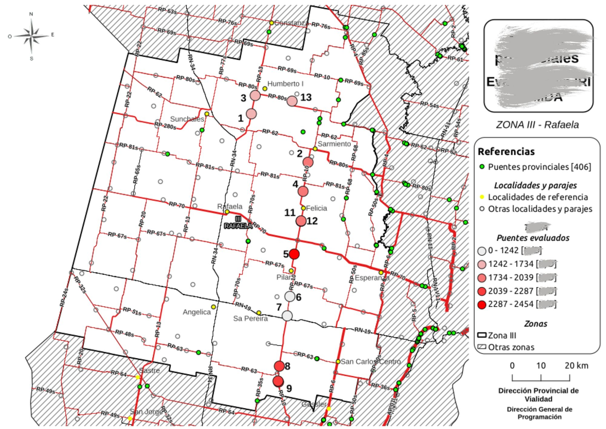
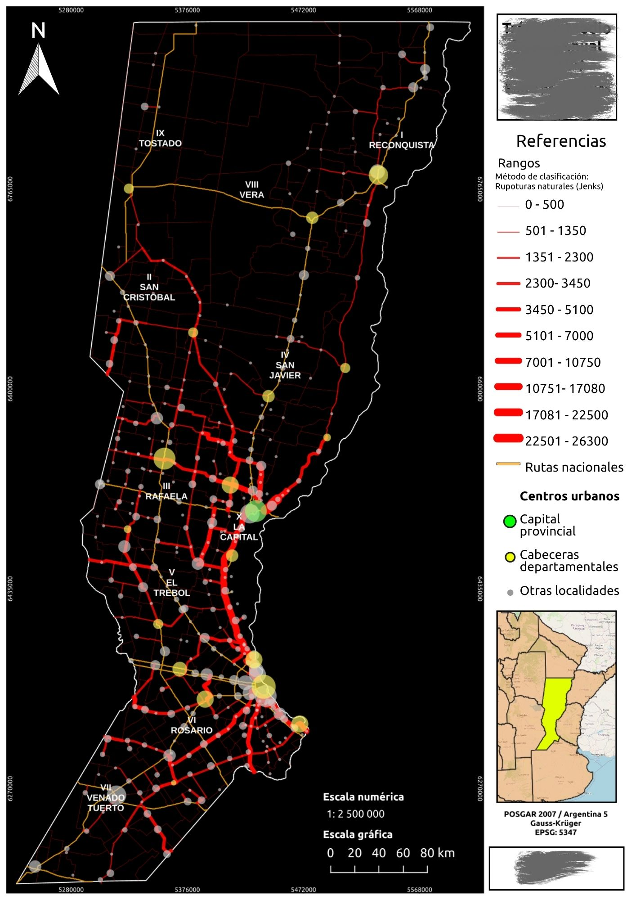

# Dirección Provincial de Vialidad (DPV)

## Sobre esta sección

Esta carpeta reúne trabajos cartográficos relacionados con la Dirección Provincial de Vialidad.

Los proyectos se presentan con fines de documentación profesional y demostración de habilidades en cartografía y Sistemas de Información Geográfica.

## Mapas

### 1. Ubicación de puentes e identificación de características

**Objetivo:** apoyar a los técnicos del área de puentes a tener una visión espacial del contexto en el que se encuentran los puentes a relevar e intervenir.
No solo centrarse en los valores de sus características o variables, sino entender su ubicación en su conjunto como otra variable con la cual determianar el orden de importancia para su relevamiento e intervención.

---

### 2. Nombre del segundo mapa

**Objetivo:** apoyar a personal del área de tránsito en la generación de cartografías y comunicación de difernetes datos.

## Consideraciones

Los archivos y las descripciones publicados respetan las condiciones de uso y las restricciones de difusión de la información de origen.

